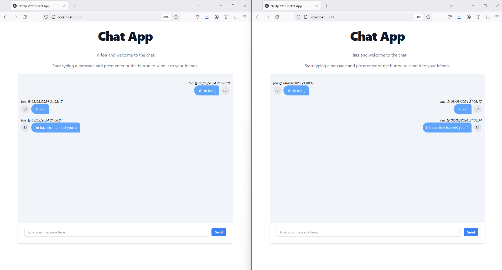

# Chat App



Simple chat application simulates a chat room, just insert a username and start chatting!
To chat between multiple user, simply open more browser tab or multiple browser instance and access to the same website!

## How to use

1. Clone the project locally
2. Go inside the folder just created and run `npm install`
3. create a local .env.local file with the following content:
```bash
NEXT_PUBLIC_SOCKET_SERVER_URL='http://localhost:5000'
SERVER_PORT=5000
```
4. From the terminal run the server with the following command:

```bash
npm run server
```
5. From the terminal run the app with the following command:

```bash
npm run start
```
6. Open [http://localhost:3000](http://localhost:3000) with your browser to see the app.
7. Open another tab / browser and access to the same website to see the chatting between multiple user.

This project uses [`next/font`](https://nextjs.org/docs/basic-features/font-optimization) to automatically optimize and load Inter, a custom Google Font.
This is a [Next.js](https://nextjs.org/) project bootstrapped with [`create-next-app`](https://github.com/vercel/next.js/tree/canary/packages/create-next-app).

## Learn More

To learn more about Next.js, take a look at the following resources:

- [Next.js Documentation](https://nextjs.org/docs) - learn about Next.js features and API.
- [Learn Next.js](https://nextjs.org/learn) - an interactive Next.js tutorial.

You can check out [the Next.js GitHub repository](https://github.com/vercel/next.js/) - your feedback and contributions are welcome!